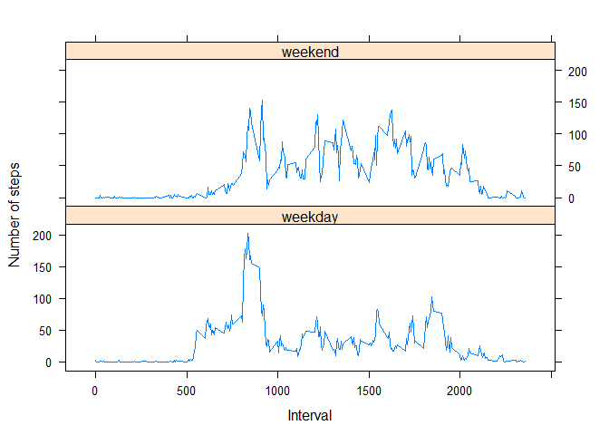

# Assignment 1


## Question #1

**What is mean total number of steps taken per day?**

For this part of the assignment, you can ignore the missing values in the dataset.

Calculate the total number of steps taken per day.
If you do not understand the difference between a histogram and a barplot, research the difference 
between them. Make a histogram of the total number of steps taken each day.
Calculate and report the mean and median of the total number of steps taken per day.

  
Load packages needed for assignment

```r
library(dplyr)
```

```
## Warning: package 'dplyr' was built under R version 3.2.3
```

```
## 
## Attaching package: 'dplyr'
```

```
## The following objects are masked from 'package:stats':
## 
##     filter, lag
```

```
## The following objects are masked from 'package:base':
## 
##     intersect, setdiff, setequal, union
```

```r
library(lattice)
```

  
Read in the file

```r
ds <- read.csv("activity.csv")
```

  
Get total steps per day and update the column names

```r
stepsPerDay <- aggregate(x=ds$steps, by=list(ds$date), FUN=sum)
colnames(stepsPerDay) <- c("date", "steps")
```

  
Create histogram

```r
hist(stepsPerDay$steps, 
     main="Total Number of Steps Taken Each Day", 
     xlab="Number of Steps", 
     col="brown")
```


  
Report the mean and median for total steps taken per day

```r
summarise(stepsPerDay, mean(steps,na.rm=TRUE), median(steps,na.rm=TRUE))
```

```
##   mean(steps, na.rm = TRUE) median(steps, na.rm = TRUE)
## 1                  10766.19                       10765
```


## Question #2

**What is the average daily activity pattern?**

Make a time series plot (i.e. type = "l") of the 5-minute interval (x-axis) and the average 
number of steps taken, averaged across all days (y-axis).

Which 5-minute interval, on average across all the days in the dataset, contains the maximum number of steps?  

  
Get average steps taken for 5 min intervals

```r
intervals <- aggregate(data=ds, steps~interval, FUN=mean, na.action=na.omit)
```

  
Create time series plot

```r
with(intervals, {
     plot(
          x=interval,
          y=steps,
          type="l",
          main="Average Number of Steps Taken (5 Minute Intervals)",
          xlab="5 Minute Interval",
          ylab="Average Steps Taken"
     )
})
```


Get the interval with the maximum average number of steps

```r
intervals$interval[ which.max(intervals$steps) ]
```

```
## [1] 835
```


## Question #3

**Imputing missing values**
 
Note that there are a number of days/intervals where there are missing values (coded as NA). 
The presence of missing days may introduce bias into some calculations or summaries of the data.
 
Calculate and report the total number of missing values in the dataset (i.e. the total number of rows with NAs).

Devise a strategy for filling in all of the missing values in the dataset. 
The strategy does not need to be sophisticated. For example, you could use the mean/median for that day, 
or the mean for that 5-minute interval, etc.
 
Create a new dataset that is equal to the original dataset but with the missing data filled in.
 
Make a histogram of the total number of steps taken each day and calculate and report the mean 
and median total number of steps taken per day. Do these values differ from the estimates from the
first part of the assignment? What is the impact of imputing missing data on the estimates of the 
total daily number of steps?  

  
Calculate and report the total number of missing values in the dataset

```r
sum(is.na(ds$steps))
```

```
## [1] 2304
```

Create new dataset filling in the NAs with 0  
- create new dataset by copying original dataset  
- replace NA values in steps column with value 0  
- get steps per day from new dataset  
- rename columns   

```r
dsFillNA <- ds
dsFillNA$steps[is.na(dsFillNA$steps)] <- 0
newStepsPerDay <- aggregate(x=dsFillNA$steps, by=list(dsFillNA$date), FUN=sum)
colnames(newStepsPerDay) <- c("date", "steps")
```

  
Create histogram of steps per day

```r
hist(newStepsPerDay$steps, 
     main="Total Number of Steps Taken Each Day (NA values replaced with value 0)", 
     xlab="Number of Steps", 
     col="black",
     border="white")
```


  
Report the mean and median for total steps taken per day with no NA values

```r
summarise(newStepsPerDay, mean(steps), median(steps))
```

```
##   mean(steps) median(steps)
## 1     9354.23         10395
```

**Do these values differ from the estimates from the first part of the assignment?**  
Yes, mean changed from 10766.19 to 9354.23 and the median changed from 10765 to 10395.  

**What is the impact of imputing missing data on the estimates of the total daily number of steps?**  
The mean and median values decreased which makes sense since you are adding valid numbers to the estimates instead of just excluding them.  


## Question #4

**Are there differences in activity patterns between weekdays and weekends?**
 
For this part the weekdays() function may be of some help here. Use the dataset with 
the filled-in missing values for this part.
 
Create a new factor variable in the dataset with two levels -- "weekday" and "weekend" 
indicating whether a given date is a weekday or weekend day.
 
Make a panel plot containing a time series plot (i.e. type = "l") of the 5-minute interval 
(x-axis) and the average number of steps taken, averaged across all weekday days or weekend days (y-axis).   
  
  
Create new dataset using dataset with filled in NA values  
- add new column indicating day of week  
- determine if day of week is a weekday or weekend  
- add column with day type  
- rename columns  
- get steps per dayType per interval  

```r
dsWithWeekday <- mutate(dsFillNA, dayofWeek=weekdays(as.Date(dsFillNA$date)))
dsDayType <- data.frame(sapply(X = dsWithWeekday$date, FUN = function(day) {
     if (weekdays(as.Date(day)) %in% c("Monday", "Tuesday", "Wednesday", "Thursday", 
                                       "Friday")) {
          day <- "weekday"
     } else {
          day <- "weekend"
     }
}))
dsWithWeekday <- cbind(dsFillNA,dsDayType[,1])
colnames(dsWithWeekday) <- c("steps", "date", "interval", "dayType")
dsDayTypeSteps <- aggregate(
     data=dsWithWeekday,
     steps~dayType + interval,
     FUN=mean
)
```

  
Create a panel plot containing time series plot for both weekend and weekday data for comparison

```r
xyplot(
     type="l",
     data=dsDayTypeSteps,
     steps~interval | dayType,
     xlab="Interval",
     ylab="Number of steps",
     layout=c(1,2)
)
```


